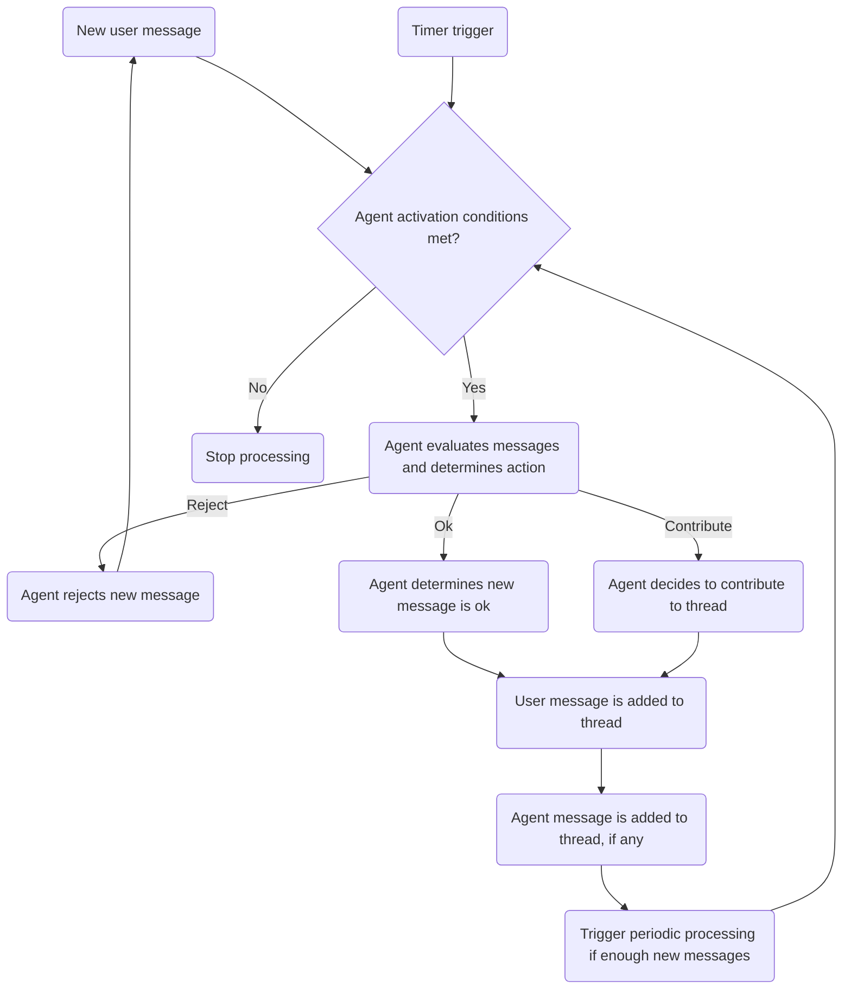

```mermaid

flowchart TB

  newMessage(New user message)
  timer(Timer trigger)
  activate{Agent activation conditions met?}
  evaluate(Agent evaluates messages and determines action)
  reject(Agent rejects new message)
  ok(Agent determines new message is ok)
  contribute(Agent decides to contribute to thread)
  stop(Stop processing)

  userMessage(User message is added to thread)
  agentMessage(Agent message is added to thread, if any)

  newMessagePeriodTrigger(Trigger periodic processing if enough new messages)

  newMessage --> activate
  timer --> activate
  activate --  Yes --> evaluate
  activate -- No --> stop
  evaluate -- Reject --> reject
  reject --> newMessage
  evaluate -- Ok --> ok
  evaluate -- Contribute --> contribute

  ok --> userMessage
  contribute --> userMessage
  userMessage --> agentMessage

  agentMessage --> newMessagePeriodTrigger
  newMessagePeriodTrigger --> activate

```
